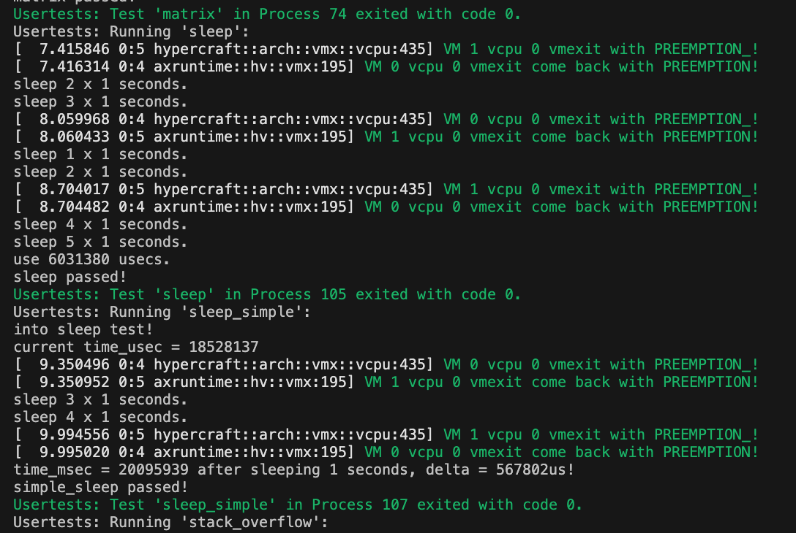
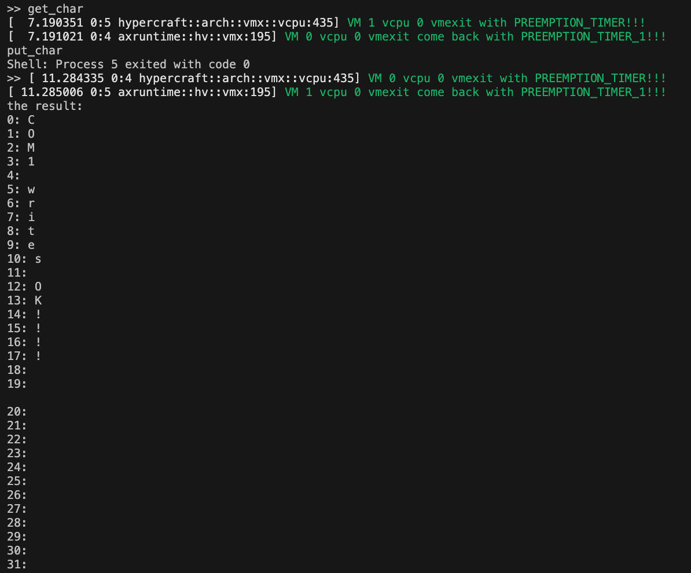

## 一个物理 cpu 绑定多个 vm 
### 功能介绍

需要完成三个功能：
- 在单个物理核心上并发运行 2 台虚拟机，每台虚拟机 1 个虚拟CPU。要求实现虚拟机和虚拟CPU相关信息的管理和切换、虚拟CPU的调度、不同虚拟机间虚拟设备的隔离。
- 支持从配置文件读取虚拟机的运行参数并依此创建虚拟机。
- 实现2台虚拟机之间的虚拟串口通信。

### 功能 1 核心思想
- 每个 vm 相当于一个线程，这样的话虚拟机的切换就相当于线程的切换。
- 线程上下文的切换虽然能够保护现场，并不完全等于虚拟机的切换：比如 vmcs 的切换。而切换 vmcs 只能在 host 中进行，所以每次切换虚拟机必须先 vmexit 到 host 中，由 host 切换，host 切换了后，加载另外一个虚拟机的 vmcs，这样 vmresume/vmlaunch 进入的才是另一个虚拟机。
- 为了使每次切换虚拟机都能成功跳转到 host，并方便调试和编程，将 os 设置为协调式，即非抢占式，这样就可以自己控制线程切换的时间点。另外，增加 PREEMPTION_TIMER 相关的中断，使得虚拟机每隔一段时间就会自动退出，方便进行线程切换。

### 功能 1 具体细节

#### 重构虚拟机相关操作

1、创建 vm.rs，并创建 VM 数据结构。id 代表虚拟机的编号，每个虚拟机都应该有独特的 id 以区分不同虚拟机。vcpu_count 代表 vcpu 数量，这里因为是单核，所以值为 1。vcpu 代表虚拟机中的所有 vcpu，为了方便日后拓展为多核，将 vcpu 设置为 vec 对象。
```rust
#[repr(C)]
pub struct VM<H: HyperCraftHal> {
    id: usize,
    vcpu_count: usize,
    vcpu: Vec<VmxVcpu<H>>,
}
```

2、将 VM 相关操作加入到该数据结构中。主要包括 new，add_vcpu，get_vcpu, get_vm_id 四种。new 函数用来创建一个新的虚拟机。add_vcpu 用来创建一个新的 vcpu，并将其加入到 VM 数据结构中。get_vcpu 根据 vcpu 在虚拟机中的 id 来获取 vcpu。get_vm_id 获取 VM 的 id，主要是为了方便后续调试和功能测试。

```rust 
impl<H: HyperCraftHal> VM<H> {
    /// create new VM
    pub fn new(
        id: usize,
    ) -> Self {
        Self {
            id: id,
            vcpu_count: 0,
            vcpu: Vec::new(),
        }
    }
    /// add a new vcpu to VM
    pub fn add_vcpu(&mut self, vmcs_revision_id: u32, entry: GuestPhysAddr, npt_root: HostPhysAddr) -> HyperResult<usize> {
        self.vcpu.push(VmxVcpu::new(self.id, self.vcpu_count,vmcs_revision_id, entry, npt_root)?);
        // update vcpu_count
        self.vcpu_count += 1;
        Ok(self.vcpu_count - 1)
    }
    /// Returns a reference to the vCPU with `vcpu_id` if it exists.
    pub fn get_vcpu(&mut self, vcpu_id: usize) -> HyperResult<&mut VmxVcpu<H>> {
        info!("{} {}", vcpu_id, self.vcpu_count);
        if vcpu_id < self.vcpu_count {
            let vcpu = &mut self.vcpu[vcpu_id];
            Ok(vcpu)
        } else {
            Err(HyperError::NotFound)
        }
        
    }
    /// get vm id
    pub fn get_vm_id(&self) -> usize{
        self.id
    }
}
```

#### 更改 vcpu 初始化和 vmexit 处理
3、在 VmxVcpu 中添加 vcpu_id 和 vm_id 变量，分别代表 vcpu 在该虚拟机中的编号和所在虚拟机的虚拟机编号。添加 get_vcpu_id，get_vm_id，load_vmcs 函数。get_vcpu_id，get_vm_id 用来获取 vcpu_id 和 vm_id 变量，方便调试。load_vmcs 函数是在切换虚拟机时，切换 vmcs，并更新 PREEMPTION_TIMER_VALUE。
```rust
pub fn load_vmcs(&self) -> HyperResult {
    let paddr = self.vmcs.phys_addr() as u64;
    unsafe {
        vmx::vmptrld(paddr)?;
    }
    VmcsGuest32::VMX_PREEMPTION_TIMER_VALUE.write(PREEMPTION_TIMER_VALUE)?;
    Ok(())
}
```
修改 setup_vmcs_guest 函数，添加：
```rust
VmcsGuest32::VMX_PREEMPTION_TIMER_VALUE.write(PREEMPTION_TIMER_VALUE)?;
```
修改 setup_vmcs_control 函数，修改 PINBASED_EXEC_CONTROLS，VMEXIT_CONTROLS：
```rust
vmcs::set_control(
    VmcsControl32::PINBASED_EXEC_CONTROLS,
    Msr::IA32_VMX_TRUE_PINBASED_CTLS,
    Msr::IA32_VMX_PINBASED_CTLS.read() as u32,
    (PinCtrl::NMI_EXITING | PinCtrl::EXTERNAL_INTERRUPT_EXITING | PinCtrl::VMX_PREEMPTION_TIMER).bits(),
    0,
)?;

vmcs::set_control(
    VmcsControl32::VMEXIT_CONTROLS,
    Msr::IA32_VMX_TRUE_EXIT_CTLS,
    Msr::IA32_VMX_EXIT_CTLS.read() as u32,
    (ExitCtrl::HOST_ADDRESS_SPACE_SIZE
        | ExitCtrl::ACK_INTERRUPT_ON_EXIT
        | ExitCtrl::SAVE_IA32_PAT
        | ExitCtrl::LOAD_IA32_PAT
        | ExitCtrl::SAVE_IA32_EFER
        | ExitCtrl::LOAD_IA32_EFER
        | ExitCtrl::SAVE_VMX_PREEMPTION_TIMER)
        .bits(),
    0,
)?;

```

4、 更改 modules/axruntime/src/hv/vmx/mod.rs 中 vmexit_handler，添加对 PREEMPTION_TIMER 的处理：
```rust
pub fn vmexit_handler(vcpu: &mut VCpu) -> HyperResult {
    let exit_info = vcpu.exit_info()?;
    
    match exit_info.exit_reason {
        VmxExitReason::EXTERNAL_INTERRUPT => handle_external_interrupt(vcpu),
        VmxExitReason::CPUID => handle_cpuid(vcpu),
        VmxExitReason::IO_INSTRUCTION => handle_io_instruction(vcpu, &exit_info),
        VmxExitReason::MSR_READ => handle_msr_read(vcpu),
        VmxExitReason::MSR_WRITE => handle_msr_write(vcpu),
        VmxExitReason::PREEMPTION_TIMER => {
            thread::yield_now();
            info!("VM {} vcpu {} vmexit come back with {:#x?}_1!!!",vcpu.get_vm_id(), vcpu.get_vcpu_id(),exit_info.exit_reason);
            vcpu.load_vmcs()
        }
        _ => panic!("vmexit reason not supported {:?}:\n{:?}", exit_info.exit_reason, vcpu)
    }
}
```

5、删除 crates/hypercraft/src/arch/x86_64/percpu.rs 中的 create_vcpu 操作，该操作已经由 vm 来操作。

#### 虚拟机隔离
6、在 apps/hv_mul/src/x64.rs 中做空间隔离，使不同虚拟机运行在不同内存中。注意 MAX_VMS 数量不能太多。因为 arceos 分配的内存不支持太多虚拟机做隔离。
```rust
pub(super) static mut GUEST_PHYS_MEMORY: [AlignedMemory<GUEST_PHYS_MEMORY_SIZE>;MAX_VMS]=
    [AlignedMemory([0; GUEST_PHYS_MEMORY_SIZE]);MAX_VMS];
pub(super) static mut IO_PHYS_MEMORY: [AlignedMemory<0x1000>;MAX_VMS]=
    [AlignedMemory([0; 0x1000]);MAX_VMS];
pub(super) static mut LAPIC_PHYS_MEMORY: [AlignedMemory<0x1000>;MAX_VMS]=
    [AlignedMemory([0; 0x1000]);MAX_VMS];

fn gpa_as_mut_ptr(guest_paddr: GuestPhysAddr, id: usize) -> *mut u8 {
    let offset = unsafe { &GUEST_PHYS_MEMORY[id] as *const _ as usize };
    let host_vaddr = guest_paddr + offset;
    host_vaddr as *mut u8
}
[cfg(target_arch = "x86_64")]
fn load_guest_image(hpa: HostPhysAddr, load_gpa: GuestPhysAddr, size: usize, id: usize) {
    let image_ptr = usize::from(phys_to_virt(hpa.into())) as *const u8;
    let image = unsafe { core::slice::from_raw_parts(image_ptr, size) };

    trace!("loading to guest memory: host {:#x} to guest {:#x}, size {:#x}", image_ptr as usize, load_gpa, size);

    unsafe {
        core::slice::from_raw_parts_mut(gpa_as_mut_ptr(load_gpa, id), size).copy_from_slice(image)
    }
}

#[cfg(target_arch = "x86_64")]
pub fn setup_gpm(id: usize) -> HyperResult<GuestPhysMemorySet> {
    // copy BIOS and guest images

    use libax::hv::HostVirtAddr;
    load_guest_image(BIOS_PADDR, BIOS_ENTRY, BIOS_SIZE, id);
    load_guest_image(GUEST_IMAGE_PADDR, GUEST_ENTRY, GUEST_IMAGE_SIZE, id);

    // create nested page table and add mapping
    let mut gpm = GuestPhysMemorySet::new()?;
    let mut guest_memory_regions = [
        GuestMemoryRegion {
            // RAM
            gpa: GUEST_PHYS_MEMORY_BASE,
            hpa: virt_to_phys((gpa_as_mut_ptr(GUEST_PHYS_MEMORY_BASE, id) as HostVirtAddr).into()).into(),
            // hpa: hpa_base,
            size: GUEST_PHYS_MEMORY_SIZE,
            flags: MappingFlags::READ | MappingFlags::WRITE | MappingFlags::EXECUTE,
        },
        GuestMemoryRegion {
            // IO APIC
            gpa: 0xfec0_0000,
            hpa: unsafe { &IO_PHYS_MEMORY[id] as *const _ as usize },
            size: 0x1000,
            flags: MappingFlags::READ | MappingFlags::WRITE | MappingFlags::DEVICE,
        },
        GuestMemoryRegion {
            // HPET
            gpa: 0xfed0_0000,
            hpa: 0xfed0_0000,
            size: 0x1000,
            flags: MappingFlags::READ | MappingFlags::WRITE | MappingFlags::DEVICE,
        },
        GuestMemoryRegion {
            // Local APIC
            gpa: 0xfee0_0000,
            hpa: unsafe { &LAPIC_PHYS_MEMORY[id] as *const _ as usize },
            size: 0x1000,
            flags: MappingFlags::READ | MappingFlags::WRITE | MappingFlags::DEVICE,
        }
    ];
    
    for r in guest_memory_regions.into_iter() {
        gpm.map_region(r.into())?;
    }
    Ok(gpm)
}
```

7、虚拟设备隔离。在 modules/axruntime/src/hv/vmx/device_emu/mod.rs 中给不同虚拟机分配不同设备：
```rust
pub const MAX_VMS: usize = 2;

lazy_static::lazy_static! {
    static ref VIRT_DEVICES : Vec<VirtDeviceList> = {
        let mut temp = Vec::new();
        for i in 0..MAX_VMS {
            temp.push(VirtDeviceList {
                port_io_devices: vec![
                    Arc::new(uart16550::Uart16550::new(0x3f8, i)), // COM1
                    Arc::new(i8259_pic::I8259Pic::new(0x20)), // PIC1
                    Arc::new(i8259_pic::I8259Pic::new(0xA0)), // PIC2
                ],
            });
        };
        temp
    };
}

pub fn all_virt_devices(id:usize) -> &'static VirtDeviceList {
    &VIRT_DEVICES[id]
}
```

#### 测试代码
测试代码在 apps/hv_mul 下。首先是让 cpu 开启 vmx 功能。之后创建两个线程，每个线程创建一个虚拟机，给每个虚拟机创建一个 vcpu。
```rust
#![no_std]
#![no_main]

extern crate alloc;
#[macro_use]
extern crate libax;

use libax::{
    hv::{
        HyperCraftHalImpl, PerCpu, VM,
    },
    info,
};
use core::sync::atomic::{AtomicUsize, Ordering};
use libax::thread;


mod x64;

const NUM_VM: usize = 2;
static FINISHED_TASKS: AtomicUsize = AtomicUsize::new(0);

#[no_mangle]
fn main(hart_id: usize) {
    println!("Hello, hv!");
    println!("into main {}", hart_id);

    let mut p = PerCpu::<HyperCraftHalImpl>::new(hart_id);
    p.hardware_enable().unwrap();
    let vmcs_revision_id = p.get_vmcs_revision_id();

    for id in 0..NUM_VM {
        thread::spawn(move || {
            println!("Hello, task {}! id = {:?}", id, thread::current().id());
            let gpm = x64::setup_gpm(id).unwrap();
            info!("{:#x?}", gpm);

            println!("Create VM{}...",id);
            let mut vm = VM::<HyperCraftHalImpl>::new(id);
            
            println!("VM {} add vcpu {}...", vm.get_vm_id(), 0);
            let vcpu_id = vm.add_vcpu(vmcs_revision_id, x64::BIOS_ENTRY, gpm.nest_page_table_root()).unwrap();

            let vcpu = vm.get_vcpu(vcpu_id).unwrap();
            println!("Running vcpu {}...", vcpu.get_vcpu_id());
            vcpu.run();

            let _order = FINISHED_TASKS.fetch_add(1, Ordering::Relaxed);
            if option_env!("SMP") == Some("1") {
                assert!(_order == id); // FIFO scheduler
            }
        });
    }

    println!("Hello, main task!");
    while FINISHED_TASKS.load(Ordering::Relaxed) < NUM_VM {
        thread::yield_now();
    }
    println!("Task yielding tests run OK!");
    
    p.hardware_disable().unwrap();

    return;

}
```
#### 测试结果
运行以下命令：
```shell
make ARCH=x86_64 A=apps/hv_mul HV=y LOG=info GUEST=nimbos run
```
跑 usertests 程序，可以看到两个虚拟机交替运行。运行结果如下图所示，该图是 usertests 的部分截取，由于在跑 sleep 程序，所以此时虚拟机的交替比较频繁：



### 功能 2 核心思想
- 由于 nimbos 功能比较简单，所以自定义一个比较简单的 yaml 配置文件。
- 将 yaml 写成二进制文件，在启动 qemu 时作为参数传递给 arceos。
- 更改 main.rs 和 x64.rs 使它们根据配置文件创建虚拟机。
### 具体细节
#### 创建 nimbos 配置文件
1、nimbos 配置文件主要内容如下所示：
```yaml
vm_count: 2
vm0: 
  id: 0
  memory: 0x100_0000
  vcpu_count: 1
  io_apic: 1
  HPET: 1
  local_apic: 1
vm1: 
  id: 1
  memory: 0x100_0000
  vcpu_count: 1
  io_apic: 1
  HPET: 1
  local_apic: 1
```
vm_count 代表要创建的虚拟机数量，接着就要对每个虚拟机进行配置。id 代表虚拟机的编号，memory 代表虚拟机分配的空间，vcpu_count 代表 vcpu 数量。io_apic，HPET，local_apic 分别代表是否要开启对应功能，1 代表开启，0 代表关闭。

#### 解析文件并传递给 arceos
2、使用 prase.py 解析 config.yaml，并将其解析为 config.bin。
```python
# coding:utf-8
import yaml
import os
import struct

# 获取当前脚本所在文件夹路径
curPath = os.path.dirname(os.path.realpath(__file__))
# 获取yaml文件路径
yamlPath = os.path.join(curPath, "config.yml")

# open方法打开直接读出来
f = open(yamlPath, 'r', encoding='utf-8')
cfg = f.read()
print(type(cfg))  # 读出来是字符串
print(cfg)

d = yaml.load(cfg)  # 用load方法转字典
print(d)
print(type(d))

merged_file = open("config.bin", "wb")
merged_file.truncate(4*1024)


merged_file.seek(0, 0)
merged_file.write(struct.pack('<Q', d['vm_count']))

for i in range(0,d['vm_count']):
    merged_file.write(struct.pack('<Q', d['vm'+str(i)]['id']))
    merged_file.write(struct.pack('<Q', d['vm'+str(i)]['memory']))
    merged_file.write(struct.pack('<Q', d['vm'+str(i)]['vcpu_count']))
    merged_file.write(struct.pack('<Q', d['vm'+str(i)]['io_apic']))
    merged_file.write(struct.pack('<Q', d['vm'+str(i)]['HPET']))
    merged_file.write(struct.pack('<Q', d['vm'+str(i)]['local_apic']))

merged_file.close()
```
3、 修改 scripts/make/qemu.mk，设置：
```
GUEST_BIN ?= apps/hv_mul_config/guest/nimbos/nimbos.bin
GUEST_BIOS ?= apps/hv_mul_config/guest/nimbos/rvm-bios.bin
GUEST_CONFIG ?= apps/hv_mul_config/guest/nimbos/config.bin

qemu_args-$(CONFIG) += \
  -device loader,addr=0x5001000,file=$(GUEST_CONFIG),force-raw=on
```

4、修改 main.rs 和 x86.rs，使其能够解析 config.bin，并根据解析文件创建虚拟机。
main.rs
```rust
#[no_mangle]
fn main(hart_id: usize) {
    println!("Hello, hv!");
    println!("into main {}", hart_id);

    let mut p = PerCpu::<HyperCraftHalImpl>::new(hart_id);
    p.hardware_enable().unwrap();
    let vmcs_revision_id = p.get_vmcs_revision_id();

    let num_vm_ptr = CONFIG_START as usize as *const usize;
    let num_vm = unsafe { num_vm_ptr.read_volatile() };
    let vms_config: Vec<usize>  =  unsafe { core::slice::from_raw_parts(num_vm_ptr.add(1), num_vm * VM_CONFIG_SIZE).to_vec()};

    for id in 0..num_vm {
        let vm_config = x64::ConfigFile {
            id: vms_config[id*VM_CONFIG_SIZE],
            memory: vms_config[id*VM_CONFIG_SIZE+1],
            vcpu_count: vms_config[id*VM_CONFIG_SIZE+2],
            io_apic: vms_config[id*VM_CONFIG_SIZE+3],
            HPET: vms_config[id*VM_CONFIG_SIZE+4],
            local_apic: vms_config[id*VM_CONFIG_SIZE+5],
        };
        thread::spawn(move || {
            println!("Hello, task {}! id = {:?}", id, thread::current().id());
            let gpm = x64::setup_gpm(id, vm_config).unwrap();
            info!("{:#x?}", gpm);

            println!("Create VM{}...",id);
            let mut vm = VM::<HyperCraftHalImpl>::new(id);
            
            println!("VM {} add vcpu {}...", vm.get_vm_id(), 0);
            let vcpu_id = vm.add_vcpu(vmcs_revision_id, x64::BIOS_ENTRY, gpm.nest_page_table_root()).unwrap();

            let vcpu = vm.get_vcpu(vcpu_id).unwrap();
            println!("Running vcpu {}...", vcpu.get_vcpu_id());
            vcpu.run();

            let _order = FINISHED_TASKS.fetch_add(1, Ordering::Relaxed);
            if option_env!("SMP") == Some("1") {
                assert!(_order == id); // FIFO scheduler
            }
        });
    }

    println!("Hello, main task!");
    while FINISHED_TASKS.load(Ordering::Relaxed) < num_vm {
        thread::yield_now();
    }
    println!("Task yielding tests run OK!");
    
    p.hardware_disable().unwrap();

    return;

}
```
x86.rs
```rust
#[derive(Clone, Copy, Debug, Eq, PartialEq)]
pub struct ConfigFile {
    pub id: usize,
    pub memory: usize,
    pub vcpu_count: usize,
    pub io_apic: usize,
    pub HPET: usize,
    pub local_apic: usize,
}

#[cfg(target_arch = "x86_64")]
pub fn setup_gpm(id: usize, config_file: ConfigFile) -> HyperResult<GuestPhysMemorySet> {
    // copy BIOS and guest images

    use libax::hv::HostVirtAddr;
    load_guest_image(BIOS_PADDR, BIOS_ENTRY, BIOS_SIZE, id);
    load_guest_image(GUEST_IMAGE_PADDR, GUEST_ENTRY, GUEST_IMAGE_SIZE, id);

    // create nested page table and add mapping
    let mut gpm = GuestPhysMemorySet::new()?;
    // let hpa_base:usize = virt_to_phys((gpa_as_mut_ptr(GUEST_PHYS_MEMORY_BASE + id * GUEST_PHYS_MEMORY_SIZE) as HostVirtAddr).into()).into();
    // let hpa_base = 0x26_8000;
    // info!("hpa_base {:x}",hpa_base);
    let mut guest_memory_regions = Vec::new();
    guest_memory_regions.push(GuestMemoryRegion {
        // RAM
        gpa: GUEST_PHYS_MEMORY_BASE,
        hpa: virt_to_phys((gpa_as_mut_ptr(GUEST_PHYS_MEMORY_BASE, id) as HostVirtAddr).into()).into(),
        // hpa: hpa_base,
        size: config_file.memory,
        flags: MappingFlags::READ | MappingFlags::WRITE | MappingFlags::EXECUTE,
    });
    if config_file.io_apic != 0 {
        guest_memory_regions.push(GuestMemoryRegion {
            // IO APIC
            gpa: 0xfec0_0000,
            hpa: unsafe { &IO_PHYS_MEMORY[id] as *const _ as usize },
            size: 0x1000,
            flags: MappingFlags::READ | MappingFlags::WRITE | MappingFlags::DEVICE,
        });
    }
    if config_file.HPET != 0 {
        guest_memory_regions.push(GuestMemoryRegion {
            // HPET
            gpa: 0xfed0_0000,
            hpa: 0xfed0_0000,
            size: 0x1000,
            flags: MappingFlags::READ | MappingFlags::WRITE | MappingFlags::DEVICE,
        });
    }
    if config_file.local_apic != 0 {
        guest_memory_regions.push(GuestMemoryRegion {
            // Local APIC
            gpa: 0xfee0_0000,
            hpa: unsafe { &LAPIC_PHYS_MEMORY[id] as *const _ as usize },
            size: 0x1000,
            flags: MappingFlags::READ | MappingFlags::WRITE | MappingFlags::DEVICE,
        });
    }
    
    for r in guest_memory_regions.into_iter() {
        gpm.map_region(r.into())?;
    }
    Ok(gpm)
}
```

#### 测试命令
运行以下命令：
```shell
make ARCH=x86_64 A=apps/hv_mul_config HV=y LOG=info GUEST=nimbos CONFIG=y run
```
运行结果应与功能 1 相同。

### 功能 3 核心思想
- 修改 nimbos 代码，创建两个应用程序 put_char，get_char。目标是 put_char 中的输出会被 get_char 读取。
- 因为 nimbos 中串口读是通过 read 函数，串口写是通过 write 函数。所以为了防止 put_char 虚拟机中的所有输出都跑到 get_char 中，需要在 nimbos 中新建一个系统调用，该系统调用会写串口中的某一个寄存器，由于写该寄存器会造成 vm-exit，所以 vmm 可以通过该系统调用连接两个虚拟机，使 put_char 虚拟机中的想要输出的部分交给 get_char 的虚拟机中。
- 修改 modules/axruntime/src/hv/vmx/device_emu/uart16550.rs，使 put_char 的输出能够成为 get_char 的输入。

#### nimbos 修改
1、put_char
```rust
#![no_std]
#![no_main]

#[macro_use]
extern crate user_lib;

use user_lib::write;
use user_lib::set_uart_int_en;
#[no_mangle]
pub fn main() -> i32 {
    set_uart_int_en(0x01);
    write(1, "COM1 writes OK!!!!\n".as_bytes());
    set_uart_int_en(0x00);
    0
}
```

2、get_char
```rust
#![no_std]
#![no_main]

#[macro_use]
extern crate user_lib;

use user_lib::read;
use user_lib::set_uart_int_en;

const LF: u8 = b'\n';

#[no_mangle]
pub fn main() -> i32 {
    set_uart_int_en(0x01);
    let mut buf = [0u8; 1];
    let mut ret = [0u8; 32];
    let mut i = 0;
    while read(0, &mut buf) > 0 && i < 32{
        ret[i] = buf[0];
        i = i+1;
        if buf[0] == LF {
            break;
        }
    }
    set_uart_int_en(0x00);
    println!("the result: ");
    for i in 0..32 {
        println!("{}: {}",i ,ret[i] as char);
    }
    0
}
```

3、创建系统调用，根据 read 函数系统调用的方法来实现新的系统调用 set_uart_int_en。

#### 修改 arceos
1、修改 modules/axruntime/src/hv/vmx/device_emu/uart16550.rs。

修改 Uart16550 数据结构，添加 int_en，baud_rate，id。int_en 代表是否使用串口链接到其他 vm，baud_rate 代表波特率，波特率相同的虚拟机才能进行传输，id 代表所在虚拟机的 id。
```rust
pub struct Uart16550 {
    port_base: u16,
    fifo: Mutex<Fifo<UART_FIFO_CAPACITY>>,
    id: usize,
    int_en: Mutex<u8>,
    pub baud_rate: usize,
}

```

修改 read 函数，需要修改 LINE_STATUS_REG 部分，因为当读数据时，需要先读 lsr，lsr 原来会调用 uart::get_char 来读取输入，但是当两个 vm 进行通信时，读的部分应该来自另一个虚拟机的输出，所以不需要该部分，对应代码如下：
```rust
LINE_STATUS_REG => {
    let mut fifo = self.fifo.lock();
    let int_en = self.int_en.lock();
    // info!("port {} read lrs, num: {}", port, fifo.num);
    if *int_en == 0 {
        if !fifo.is_full() {
            if let Some(c) = uart::getchar() {
                fifo.push(c);
            }
        }
    } 
    
    let mut lsr = LineStsFlags::OUTPUT_EMPTY;
    if !fifo.is_empty() {
        lsr |= LineStsFlags::INPUT_FULL;
    }
    lsr.bits()
}
```

修改 write 函数，增加对 INT_EN_REG 的处理。另外，需要修改对 DATA_REG 的处理，当两个 vm 进行通信时，写的数据应该写入和他同波特率的 uart 的 fifo 中。对应代码如下：
```rust
match port - self.port_base {
    DATA_REG => {
        let int_en = self.int_en.lock();
        
        if *int_en == 1 {
            // info!("port {} write {}", port,value);
            for i in 0..MAX_VMS {
                if i == self.id {
                    // not print self
                    continue;
                }
                // info!("port {} write {}_12", port,value);
                if let Some(uart) = all_virt_devices(i).find_uart(port) {
                    // other vm with same baud_rate
                    if uart.baud_rate == self.baud_rate {
                        let mut fifo: spin::MutexGuard<'_, Fifo<UART_FIFO_CAPACITY>> = uart.fifo.lock();
                        
                        if !fifo.is_full() {
                            // info!("port {} write fifo {:#?}", port, fifo.num);
                            fifo.push(value as u8);
                        }
                    }
                    
                }
            }
            
        } else {
            uart::putchar(value as u8);
        }
        
    }
    INT_EN_REG => {
        let mut int_en = self.int_en.lock();
        *int_en = value as u8;
    }
    FIFO_CTRL_REG | LINE_CTRL_REG | MODEM_CTRL_REG | SCRATCH_REG => {
        info!("Unimplemented serial port I/O write: {:#x}", port); // unimplemented
    }
    LINE_STATUS_REG => {} // ignore
    _ => unreachable!(),
}
```
#### 测试命令
运行以下命令：
```shell
make ARCH=x86_64 A=apps/hv_mul_config HV=y LOG=info GUEST=nimbos CONFIG=y run
```
跑 get_char 和 putchar 程序，运行结果如下图所示：

